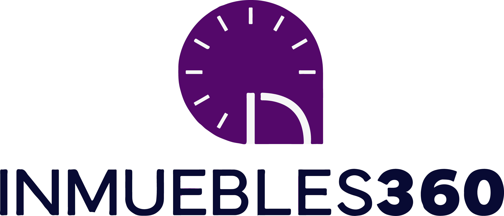

# "Inmuebles 360" --> Proyecto final (soyHenry)

## Acerca del proyecto:

Inmuebles 360 es nuestra propuesta de proyecto final en el bootcamp de soyHenry. Se trata de una aplicacion de alquiler inmobiliario, ya sea para vivir, o para alojarse durante unas vacaciones. Esta plataforma simplifica el proceso de alquilar y gestionar propiedades, brindando una experiencia amigable tanto para propietarios como para inquilinos.

## Caracteristicas del proyecto:

Nuestra app cuenta con un formulario de registro en caso de no estar registrado, de lo contrario te podes autenticar localmente o con Google (para mayor comodidad). Tenemos una pagina de inicio atractiva, donde visualizamos una barra de navegacion, por debajo una barra de busqueda por nombre/pais/ciudad, tambien pueden aplicarse filtros (por tipo o precio), y mas por debajo se encuentran las propiedades, ellas poseen un boton para agregar a favoritos, las imagenes de las propiedades, y las principales caracteristicas, tambien un boton para acceder al detalle de cada propiedad.
Tenemos tambien un panel de superadmin donde se pueden gestionar los usuarios y las propiedades registradas.
Cualquier persona mayor de 18 años puede registrarse como propietario o inquilino, lo que democratiza la participación en la plataforma. Los propietarios pueden listar sus propiedades, y los inquilinos pueden buscar y alquilar aquellas que cumplan con sus requisitos. Tambien hemos integrado una pasarela de pagos segura que facilita las transacciones entre propietarios e inquilinos.

### Utilizamos una gran _variedad de tecnologias_, entre ellas: React, JavaScript, HTML, Redux, Tailwind, Bootstrap, AntDesign, Node, Cloudinary, Express, Mongodb, Nodemailer, Passport, Stripe, Formik...

## Como ejecutar el proyecto:

Para ejecutar el proyecto en tu entorno local, sigue estos pasos:

```git
1 - Clona este repositorio en tu maquina local:

git clone https://github.com/joaBotto/proyectofinal.git

2 - Accede al repositorio del proyecto:

cd ../../../

3 - Instala las dependencias:

npm install

4 - Configura las variables de entorno en un archivo .env

5 - Inicia la app:

npm start en /Client y lo mismo para /Server

```

La aplicacion estara disponible en "http://localhost:3000"

### soyHenry

Este proyecto fue desarrollado como parte de nuestro bootcamp en "SoyHenry". Durante nuestra formación, hemos adquirido las habilidades y conocimientos necesarios para crear aplicaciones web de alta calidad. Inmuebles 360 es la culminación de nuestro aprendizaje y es un testimonio de nuestro compromiso y dedicación en el campo del desarrollo web.

### Autores

Los integrantes que participaron de este proyecto son: Alina Piccardo, Sergio Vazquez, Lorena Florio, Rodrigo Gamero, Jon Scar, Guillermo Llanos, Federico Rojo y Joaquin Botto.
